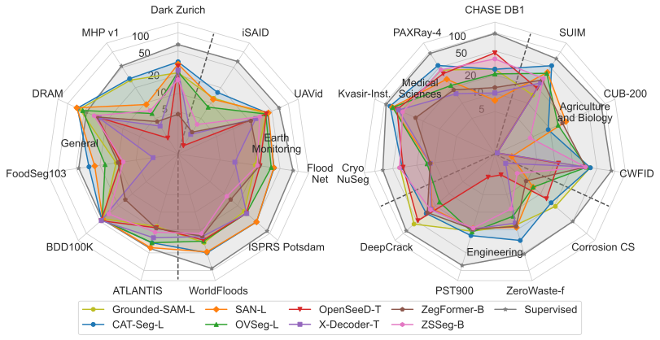

The MESS benchmark enables a holistic evaluation of semantic segmentation models on a variety of domains and datasets. The MESS benchmark includes 22 datasets for different domains like medicine, engineering, earth monitoring, biology, and agriculture.

## Datasets

The MESS benchmark represents different domains and characteristics relevant to semantic segmentation. For a holistic evaluation, we developed the following taxonomy and classified 120 datasets. The 22 selected MESS datasets are highlighted bold in the following figure. You find detail of the datasets, including the links and licences, in this [0verview](https://github.com/blumenstiel/MESS/blob/main/mess/DATASETS.md).    


---

## Toolkit

The [toolkit](https://github.com/blumenstiel/MESS) includes scripts for easy preparation and evaluation of the MESS benchmark. The toolkit uses [detectron2](https://github.com/facebookresearch/detectron2), which enables the registration of all datasets with just one extra line of code:
    
```python
import mess.datasets
```

---

## Leaderboard

You find the results of all evaluated models at our [leaderboard](https://blumenstiel.github.io/mess-benchmark/).



---

## Paper

**<center>What a MESS: Multi-Domain Evaluation of Zero-Shot Semantic Segmentation</center>**

<center>Benedikt Blumenstiel*, Johannes Jakubik*, Hilde Kühne , Michael Vössing</center>

<center><small>* Equal contributions</small></center>

While semantic segmentation has seen tremendous improvements in the past, there is still significant labeling efforts necessary and the problem of limited generalization to classes that have not been present during training. To address this problem, zero-shot semantic segmentation makes use of large self-supervised vision-language models, allowing zero-shot transfer to unseen classes. In this work, we build a benchmark for Multi-domain Evaluation of Semantic Segmentation (MESS), which allows a holistic analysis of performance across a wide range of domain-specific datasets such as medicine, engineering, earth monitoring, biology, and agriculture. To do this, we reviewed 120 datasets, developed a taxonomy, and classified the datasets according to the developed taxonomy. We select a representative subset consisting of 22 datasets and propose it as the MESS benchmark. We evaluate eight recently published models on the proposed MESS benchmark and analyze characteristics for the performance of zero-shot transfer models. The toolkit is available at https://github.com/blumenstiel/MESS.

Please cite our paper if you use the MESS benchmark.

```
@article{MESSBenchmark2023,
  title={{What a MESS: Multi-domain Evaluation of Zero-shot Semantic Segmentation}},
  author={Blumenstiel, Benedikt and Jakubik, Johannes and Kühne, Hilde and Vössing, Michael},
  year={2023}
}
```
