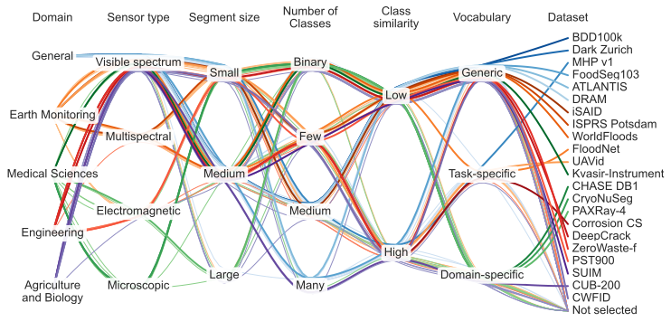

The MESS benchmark enables a holistic evaluation of semantic segmentation models on a variety of domains and datasets.
The collection is based on a developed taxonomy which describes the semantic segmentation task space along six dimensions. 
We classified 120 datasets according to the taxonomy, visualized in the following figure.
The 22 selected MESS datasets, highlighted with bold lines, cover all identified characteristics and are various domains such as earth monitoring, medicine, or engineering. 
You find details of the datasets, including links and licences, in this [overview](https://github.com/blumenstiel/MESS/blob/main/mess/DATASETS.md#dataset-overview).    

<center>

</center>


### Why MESS?

Zero-shot semantic segmentation models are regularly trained on COCO Stuff, a dataset including common scenes and classes. 
The standard evaluation datasets of these models are ADE20K, Pascal Context, and Pascal VOC. 
These datasets are from the same domain as the training data and therefore only test an in-domain transfer setting. 
With MESS, we provide a benchmark that enables a holistic evaluation of the generalization capabilities in a variety of other domains and use cases. 
The MESS evaluation is currently focused on zero-shot transfer – with potential extensions for few-shot or many-shot settings.

---

## Toolkit

The [toolkit](https://github.com/blumenstiel/MESS) includes scripts for easy preparation and evaluation of the MESS benchmark. The toolkit uses [detectron2](https://github.com/facebookresearch/detectron2), which enables the registration of all datasets with just one extra line of code:
    
```python
import mess.datasets
```

---

## Benchmark results

You find the results of all evaluated models in the [leaderboard](https://blumenstiel.github.io/mess-benchmark/leaderboard/). A more detailed analysis is provided in our paper.   

<center>

</center>

---

## Paper

[**<center>What a MESS: Multi-Domain Evaluation of Zero-Shot Semantic Segmentation</center>**](https://arxiv.org)

<center>Benedikt Blumenstiel*,  Johannes Jakubik*,  Hilde Kühne,  Michael Vössing</center>

<center><small>* Equal contributions</small></center>

While semantic segmentation has seen tremendous improvements in the past, there is still significant labeling efforts necessary and the problem of limited generalization to classes that have not been present during training. To address this problem, zero-shot semantic segmentation makes use of large self-supervised vision-language models, allowing zero-shot transfer to unseen classes. In this work, we build a benchmark for Multi-domain Evaluation of Semantic Segmentation (MESS), which allows a holistic analysis of performance across a wide range of domain-specific datasets such as medicine, engineering, earth monitoring, biology, and agriculture. To do this, we reviewed 120 datasets, developed a taxonomy, and classified the datasets according to the developed taxonomy. We select a representative subset consisting of 22 datasets and propose it as the MESS benchmark. We evaluate eight recently published models on the proposed MESS benchmark and analyze characteristics for the performance of zero-shot transfer models. The toolkit is available at <https://github.com/blumenstiel/MESS>.

Please cite our paper if you use the MESS benchmark and send us your results to be included in the leaderboard.

```text
@article{MESSBenchmark2023,
  title={What a MESS: Multi-domain Evaluation of Zero-shot Semantic Segmentation},
  author={Blumenstiel, Benedikt and Jakubik, Johannes and Kühne, Hilde and Vössing, Michael},
  journal={arXiv preprint arXiv:XXXX.XXXXX},
  year={2023}
}
```
